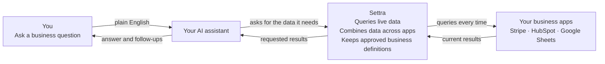

# Settra

**Ask your AI questions about live business data—without uploading the same
files again.**

Settra connects your AI assistant to Stripe, HubSpot, and Google Sheets. Connect
each source once, then ask questions in plain English. Settra queries the
original source every time, so the answer uses the latest available data, not an
old export.

Settra is for business owners and operators who already use AI but do not want
to build and maintain a new internal tool for every question.

> [!IMPORTANT]
> You can run Settra on a server you control or ask us to host it for you. You
> do not need to be a developer to use it after setup. For managed hosting,
> email [support@outermeasure.com](mailto:support@outermeasure.com).

https://github.com/user-attachments/assets/63f8b52a-7618-405d-9601-d24eea2bdbbf

## What can I ask?

- "Which customers have not paid in the last 60 days?"
- "Which HubSpot leads became paying Stripe customers?"
- "Compare this month's Stripe revenue with the target in my Google Sheet."
- "What changed since last week, and which accounts should I follow up with?"

You can ask follow-up questions as you would with an analyst. When a useful
definition or relationship is approved, such as what counts as revenue or how a
contact maps to a customer, Settra can keep it for future questions.

## How it works

You connect your apps and AI assistant once. After that, this loop runs again
for every question. If a value changes in your Google Sheet, the next query
reads the updated value; you do not need to upload the sheet again.

For cross-app questions, Settra can combine data during the same request. For
example, it can compare current Stripe revenue with targets in Google Sheets or
connect HubSpot leads to their Stripe payment history.

## Why not just upload a file or use an API?

**An uploaded file is a snapshot.** It is easy to analyze, but it becomes stale
as soon as the source changes. You have to export and upload it again.

**An API is a doorway into one app.** It gives a developer access to data, but
it does not tell your AI which fields matter, how records in different apps
relate, or what your business means by "revenue."

**Settra uses those APIs for your AI.** It provides one place to query multiple
apps, adds the business context needed to interpret the results, and lets that
context be reviewed and reused. Once it is set up, you can ask a new question
instead of building a new integration.

## How your data is handled

When you self-host Settra, it runs inside infrastructure you control and queries
your apps only when needed. Your app credentials stay on that server, and Settra
does not store MCP request or response contents in its request history.

The requested results are sent to the AI assistant you connected so it can
answer your question. The privacy and data-retention policies of that AI
provider still apply.

## What you need

- A Settra deployment, either self-hosted or managed for you.
- At least one supported app: Stripe, HubSpot, or Google Sheets.
- An AI assistant or agent that can connect to an MCP server.
- One-time technical help if you choose to self-host and do not deploy software
  yourself.

MCP is the standard Settra uses to let an AI assistant call outside tools. You
do not need to understand MCP to use Settra, but the person handling setup will.

## For developers

- [Self-hosting and technical setup](SELF-HOSTING.md)
- [Architecture and API reference](AGENTS.md)
- [Contributing](CONTRIBUTING.md)
- [Cross-app model examples](semantic_overlays/README.md)

Settra is open source and released under the
[Apache License 2.0](LICENSE).
