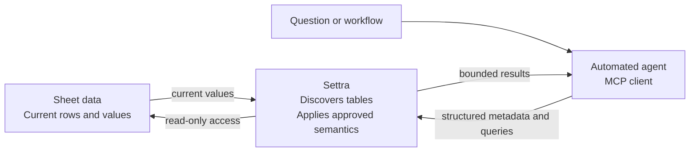

# Settra

**Make live sheet data easy for automated agents to use, without uploading the
same files again.**

Settra makes sheet data available to AI assistants and automated agents through
MCP. Connect sheet data once and agents can discover its worksheets,
understand clean header rows, inspect bounded samples, and query current values
through a governed semantic layer.

It is built for teams that use spreadsheets as operational data stores and want
agents to work with that data safely and repeatably.

> [!IMPORTANT]
> You can run Settra on a server you control or ask us to host it for you. For
> managed hosting, email
> [support@outermeasure.com](mailto:support@outermeasure.com).

## What can agents do?

- Find overdue items in an operations tracker.
- Summarize this month's pipeline from a sales worksheet.
- Compare actual values with targets stored in another tab.
- Identify rows that changed or need follow-up.
- Reuse an approved definition such as “active customer” or “recognized
  revenue” in later queries.

## How it works

```mermaid
flowchart LR
    sheet["Sheet data<br/>Current rows and values"]
    settra["Settra<br/>Discovers tables<br/>Applies approved semantics"]
    agent["Automated agent<br/>MCP client"]
    task["Question or workflow"]

    task --> agent
    agent -->|"structured metadata and queries"| settra
    settra -->|"read-only access"| sheet
    sheet -->|"current values"| settra
    settra -->|"bounded results"| agent
```

Settra uses the first row of each tab as column headers and exposes worksheet
records to agents. It also provides raw sheet, spreadsheet, and cell metadata
for discovery and troubleshooting. Queries always read the connected sheet
data, so agents do not depend on stale exports.

Cube Core is the canonical semantic layer. It gives agents stable names,
measures, dimensions, business definitions, and validation rules instead of
unrestricted SQL access.

## How data is handled

When self-hosted, Settra runs inside infrastructure you control. Google service
account credentials remain on that server. Credentials and MCP request/response
contents are not stored in SQLite; request history contains privacy-safe usage
metrics only.

Query results are sent to the AI assistant or agent you connect, so that
provider's privacy and retention policies still apply.

## What you need

- A Google Sheet with a header row and tabular data.
- A Google service account with Viewer access to that spreadsheet, or an
  advanced OAuth token mounted in the Steampipe container.
- A Settra deployment.
- An MCP-compatible AI assistant or automated agent.

## For developers

- [Self-hosting and technical setup](SELF-HOSTING.md)
- [Architecture and API reference](AGENTS.md)
- [Google Sheets setup guide](connectors/googlesheets/README.md)
- [Sheet-specific semantic models](semantic_overlays/README.md)
- [Contributing](CONTRIBUTING.md)

Settra is open source under the [Apache License 2.0](LICENSE).
