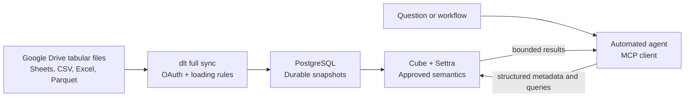

# Settra

**Make tabular file data durable and easy for automated agents to use.**

Settra is a self-hosted MCP server that synchronizes source data into PostgreSQL
and exposes durable snapshots through a governed semantic layer.
Automated agents can discover exact schemas, inspect bounded samples, and run
structured queries without raw SQL or direct access to source credentials.

It is built for teams that want agents to work with operational data safely,
consistently, and repeatably. The current release supports Google Sheets, CSV,
Excel, and Parquet files selected from Google Drive.

Sources and destinations are modeled separately. Each pipe connects one Drive
file to a registered destination and target namespace. Today Settra seeds one
explicit **Managed PostgreSQL** destination backed by the deployment's
`POSTGRES_*` settings, leaving a clean boundary for additional destination
types later.

> [!IMPORTANT]
> You can run Settra on a server you control or ask us to host it for you. For
> managed hosting, email
> [support@outermeasure.com](mailto:support@outermeasure.com).

## What can agents do?

- Find overdue items in an operations tracker.
- Summarize this month's pipeline from a sales worksheet.
- Compare actual values with targets stored in another tab.
- Identify rows that changed or need follow-up.
- Reuse an approved definition such as “active customer” or “recognized
  revenue” in later queries.

## How it works

```mermaid
flowchart LR
    sheet["Google Drive tabular files<br/>Sheets, CSV, Excel, Parquet"]
    sync["dlt full sync<br/>OAuth + loading rules"]
    postgres["PostgreSQL<br/>Durable snapshots"]
    settra["Cube + Settra<br/>Approved semantics"]
    agent["Automated agent<br/>MCP client"]
    task["Question or workflow"]

    task --> agent
    agent -->|"structured metadata and queries"| settra
    sheet --> sync
    sync --> postgres
    postgres --> settra
    settra -->|"bounded results"| agent
```

Settra detects the file format and initial CSV delimiter, encoding, and header
row, then performs a complete replacement load with dlt. PostgreSQL keeps the
last successful snapshot available while a new one is staged. Per-source YAML
controls parsing overrides, selected sheets, schedules, types, names, schema
contracts, and descriptions.

The canonical semantic layer gives agents stable names, measures, dimensions,
business definitions, and validation rules instead of unrestricted SQL access.

Collections group related pipes into focused agent workspaces. An agent using
the global MCP URL asks which collection to use, loads its context once, and
queries only its derived destination tables and cubes. A collection-specific
MCP URL can optionally pin that selection.

Each account starts with a private personal workspace. Connections,
collections, Google authorization, semantic assets, Cube queries, MCP grants,
and request metrics are isolated to that workspace. The membership model is
ready for shared organization workspaces without changing object ownership.

## How data is handled

When self-hosted, Settra runs inside infrastructure you control. The Google OAuth
refresh token is encrypted per workspace with `SECRET_KEY` on the data volume and is not stored
in the product database or source YAML. MCP request/response contents are also
not stored; PostgreSQL request history contains privacy-safe usage metrics only.

Query results are sent to the AI assistant or agent you connect, so that
provider's privacy and retention policies still apply.

## What you need

- A Google Sheet, CSV, Excel, or Parquet file in Google Drive.
- A Google Cloud Web OAuth client plus a browser-restricted Google Picker API
  key. Settra requests file-specific access only to files users select.
- A Settra deployment.
- An MCP-compatible AI assistant or automated agent.

## For developers

- [Self-hosting and technical setup](SELF-HOSTING.md)
- [Product database and migrations](DATABASE.md)
- [Google Cloud OAuth and Picker setup](GCP-SETUP.md)
- [Architecture and API reference](AGENTS.md)
- [Google Drive source setup guide](connectors/googledrive/README.md)
- [Contributing](CONTRIBUTING.md)

Settra is open source under the [Apache License 2.0](LICENSE).
